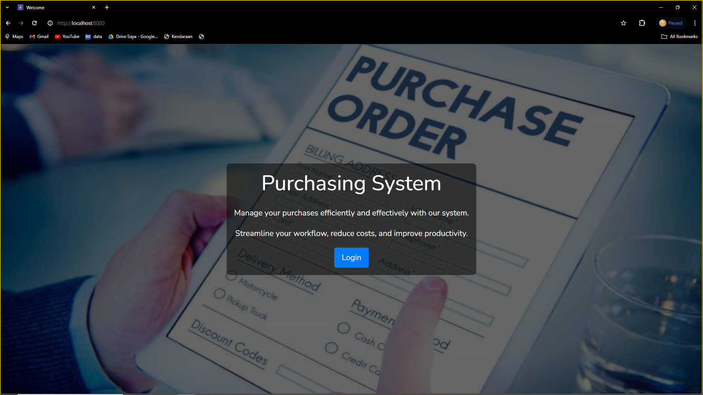
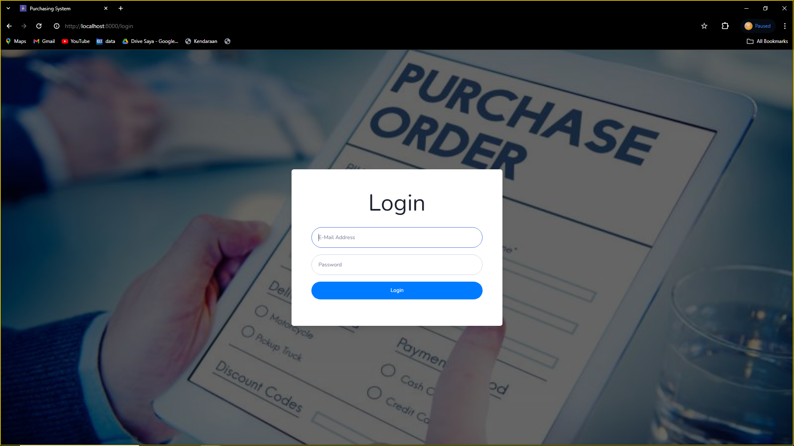
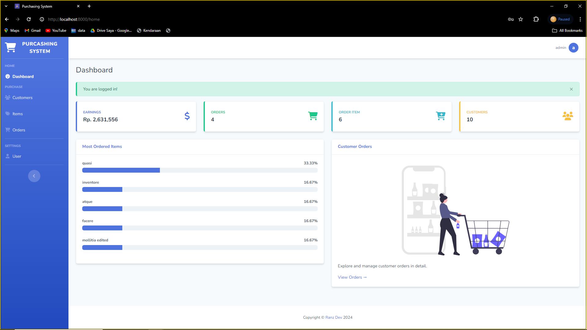
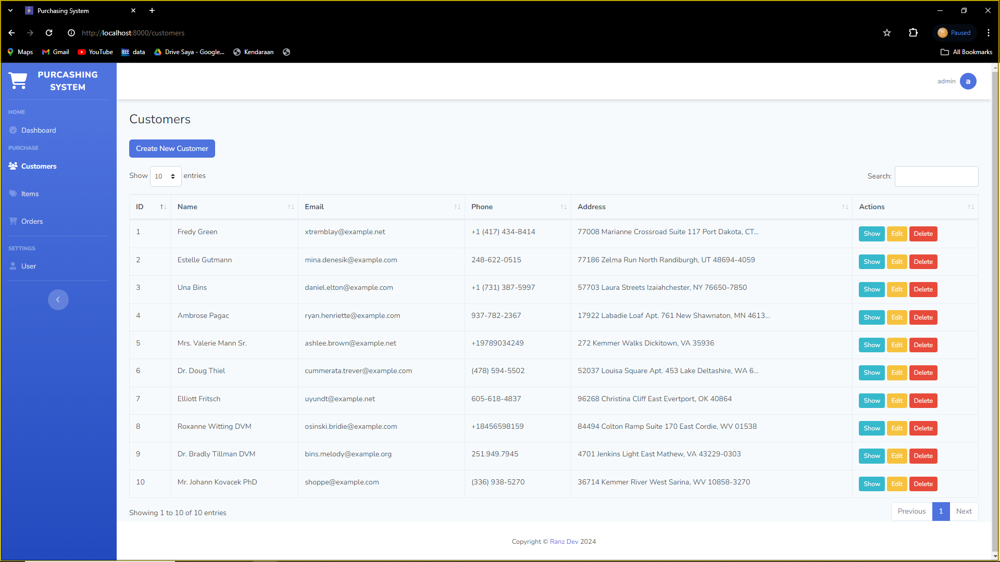
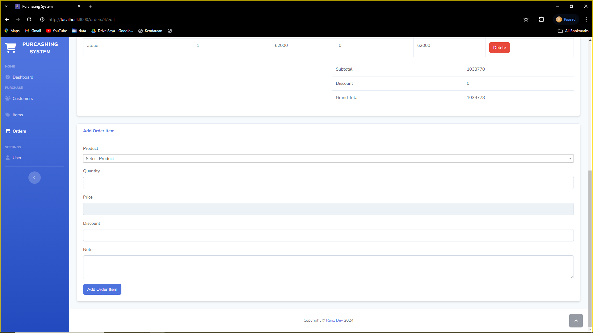

# Purchasing System

Purchasing System for Laravel.

## Installation

- Clone the repo and `cd` into it
- Run `composer install`
- Rename or copy `.env.example` file to `.env`
- Run `php artisan key:generate`
- Set your database credentials in your `.env` file
- Run `php artisan migrate:fresh --seed`
- Run `php artisan serve`
- Open `http://localhost:8000/login`
- Login with credential
  admin@admin.com / admin or staff@mail.com / staff
- Explore the Purchasing System

## Preview

`welcome`

---

`login`

---

`dashboard`

---

`admin page`

---

## Link Demo Web

https://youtu.be/s-j7nsmjKf0
